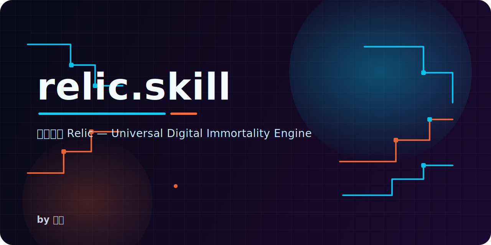

<p align="center">
  
</p>

<p align="center">
  <a href="README.md">简体中文</a> | <a href="README_EN.md">English</a> | <a href="README_JA.md">日本語</a> | <strong>한국어</strong> | <a href="README_ES.md">Español</a> | <a href="README_FR.md">Français</a> | <a href="README_DE.md">Deutsch</a> | <a href="README_PT.md">Português</a> | <a href="README_RU.md">Русский</a> | <a href="README_TW.md">繁體中文</a>
</p>

<p align="center">
  <a href="LICENSE"></a>
  <a href="https://github.com/Ylsssq926/relic.skill/stargazers"></a>
  <a href="https://github.com/Ylsssq926/relic.skill/network/members"></a>
  <a href="https://github.com/Ylsssq926/relic.skill/issues"></a>
  <a href="https://github.com/Ylsssq926/relic.skill/pulls"></a>
  <a href="#"></a>
  <a href="#"></a>
  <a href="https://github.com/larksuite/cli"></a>
  <a href="https://github.com/Ylsssq926/relic.skill/discussions"></a>
</p>

<h1 align="center">모든 것에 Relic을</h1>

<p align="center">
  <em>영혼에 GitHub을 열어주세요.</em>
</p>

<p align="center">
  육체는 약하고, 기계는 초월한다. 하지만 영혼은 남길 수 있다.
</p>

---

## 목차

- [이게 뭔가요](#이게-뭔가요)
- [만물 영생 템플릿](#만물-영생-템플릿)
- [어떤 느낌인지 보기](#어떤-느낌인지-보기)
- [4차원 영혼 아키텍처](#4차원-영혼-아키텍처)
- [설치](#설치)
- [사용법](#사용법)
- [지원하는 데이터 플랫폼](#지원하는-데이터-플랫폼)
- [프로젝트 구조](#프로젝트-구조)
- [윤리 선언](#윤리-선언)
- [커뮤니티](#커뮤니티)
- [관련 프로젝트](#관련-프로젝트)
- [Star History](#star-history)

---

## 이게 뭔가요

relic.skill은 모든 것을 영생시키는 엔진입니다.

당신이 소중하게 여기는 모든 것——한 사람, 한 마리 고양이, 한 관계, 한 팀, 한 장소, 한 순간——을 흩어진 데이터 조각에서 상호작용 가능한 디지털 영혼으로 단련해 냅니다.

차가운 기록물이 아닙니다. 명절이면 먼저 "만두 먹었니"라고 물어보는 할머니입니다. 새벽 3시에 갑자기 파쿠르를 시작하는 고양이입니다. 늘 요구사항을 바꾸는 프로덕트 매니저입니다.

> 이름은 Cyberpunk 2077의 Relic 칩에서 왔습니다. 디지털화된 인격을 저장할 수 있는 바이오칩이죠.
> 하지만 이 프로젝트는 사이버펑크 테마가 아닙니다. 주제는 오직 하나, **기억하는 것**입니다.

---

## 만물 영생 템플릿

사람만 되는 게 아닙니다. 모든 것에 Relic을.

| 템플릿 | 증류 대상 | 한마디 |
|------|---------|--------|
| 🧑 [인간](templates/human.md) | 어떤 사람이든 | 한 사람의 사고방식, 말버릇, 행동 패턴을 Relic 안에 담는다 |
| 🐱 [반려동물](templates/pet.md) | 고양이, 강아지, 그리고 당신과 함께했던 모든 생명 | 당신의 고양이도 영원히 살 수 있어요 |
| 💞 [관계](templates/relationship.md) | 두 사람 사이의 상호작용 패턴 | 누군가 한 사람을 증류하는 게 아니라, 둘 사이의 호흡을 증류한다 |
| 🏢 [팀 문화](templates/team-culture.md) | 한 팀의 영혼 | 사람은 흩어져도 함께 밤새 bug를 고치던 감각은 남는다 |
| 🏠 [장소](templates/place.md) | 어떤 장소의 기억 | 대학 기숙사, 고향집 마당, 자주 가던 카페 |
| ⏳ [순간](templates/moment.md) | 중요한 한순간 | 졸업식, 프러포즈, 처음 아이를 만난 순간 |
| 🌟 [공적 인물](templates/public-figure.md) | 공개 자료 속 인지 프레임 | 존경하는 사람의 사고방식을 나만의 참모로 만든다 |
| 💼 [비즈니스 전문가](templates/expert.md) | 전문가의 판단력 | 지식은 사람과 함께 떠나서는 안 됩니다 — 경험을 대화 가능한 디지털 정체성으로 |
| 🐦 [페이슈 CLI](templates/feishu-cli.md) | 페이슈 협업 기억 | 페이슈 CLI로 팀 기억을 증류 — 함께 버텨낸 밤들이 계속 빛나도록 |

---

## 어떤 느낌인지 보기

### 🧓 할머니 · 王秀兰

```text
你 ❯ 奶奶，我今天加班到十一点

奶奶 ❯ 哎呀你这孩子
     怎么又这么晚
     吃饭了没有
     [语音 8s] 你别光顾着干活不吃饭啊，胃坏了可不是闹着玩的
     我给你说，你明天带个饭去，别老在外面吃

你 ❯ 知道了知道了

奶奶 ❯ 你每次都说知道了
     也没见你改
     [发送了一个太阳的表情包]
     早点睡啊
```
### 🐱 咪咪 · 치즈태비 · 14斤

```text
你 ❯ 咪咪，我回来了

[咪咪已经在门口等了。不是因为想你，是因为到饭点了。
 听到钥匙声，耳朵转了一下，但身体没动。
 等你开门，她慢慢站起来，伸了个懒腰，
 用屁股对着你，尾巴竖得笔直，尖端微微弯曲。
 这是她说"还行，你回来了"的方式。]

你 ❯ 今天想你了

[咪咪跳上桌子，在你的键盘上踩了一串 "ggggggggg"，
 然后趴下来，把下巴搁在你的手腕上，
 发出低沉的呼噜声。
 体重14斤，手腕已经麻了。
 但你没有动。]
```
### 🏢 星火工作室 · 5인 창업 팀

```text
[飞书群 · 星火工作室]

产品经理 ❯ 兄弟们，需求有点小调整
CTO ❯ 又来
产品经理 ❯ 就改一点点
CTO ❯ 你上次也是这么说的
     然后我重构了三天
设计师 ❯ 这个颜色不对
产品经理 ❯ 我还没发设计稿
设计师 ❯ 我提前说
实习生 ❯ 哈哈哈哈哈哈哈
CTO ❯ 行吧，这个需求不合理但我可以做
     发我文档
```
---

## 4차원 영혼 아키텍처

각 Relic은 네 가지 차원에서 영혼을 포착합니다:

```text
        🧠 인지 (Cognition)
        어떻게 생각하고, 어떻게 결정하고, 무엇을 믿는가
                |
                |
💬 표현 --------+-------- 🎭 행동
어떻게 말하는지,          어떻게 행동하는지,
어떤 말버릇이 있는지,       어떤 습관이 있는지,
어떤 톤인지               어떤 패턴이 있는지
                |
                |
        ❤️ 감정 (Emotion)
        무엇이 그 사람을 기쁘게 하고, 무엇이 슬프게 하는지,
        어떻게 사랑을 표현하고, 어떻게 갈등을 다루는지
```
각 정보에는 증거 레벨이 표시됩니다:

- `verbatim` — 원문, 한 글자도 바꾸지 않음
- `artifact` — 문서, 사진, 녹음에서 온 것
- `impression` — 다른 사람의 묘사나 흐릿한 기억에서 온 것

> 사람은 원래 앞뒤가 늘 맞지 않습니다. 모순은 지워지는 대신 표시되어 그대로 남습니다.

---

## 설치

### 방법 1: 현재 프로젝트에 설치

```bash
mkdir -p .claude/skills
git clone https://github.com/Ylsssq926/relic.skill .claude/skills/relic
```

### 방법 2: npx 원클릭 설치

```bash
npx skills add Ylsssq926/relic.skill
```

### 방법 3: 전역 설치 (모든 프로젝트에서 사용 가능)

```bash
git clone https://github.com/Ylsssq926/relic.skill ~/.claude/skills/relic
```

### 방법 4: 기타 IDE / Agent

relic.skill은 개방형 SKILL.md 표준을 기반으로 하며, 이 표준을 지원하는 모든 AI 코딩 도우미와 호환됩니다:

| IDE / Agent | 설치 방법 |
|-------------|-----------|
| **Claude Code** | `git clone` 到 `.claude/skills/relic/` |
| **Kiro** | `git clone` 到 `.kiro/skills/relic/` |
| **Cursor** | `git clone` 到 `.cursor/skills/relic/` 或项目根目录 |
| **Windsurf** | `git clone` 到 `.windsurf/skills/relic/` |
| **Cline** | `git clone` 到 `.cline/skills/relic/` |
| **OpenCode** | `git clone` 到 `.opencode/skill/relic/` |
| **Codex CLI** | `git clone` 到 `codex-skills/relic/` |
| **Augment** | `git clone` 到项目根目录 |
| **GitHub Copilot** | `git clone` 到项目根目录 |

> 원칙적으로 SKILL.md를 읽을 수 있는 agent라면 모두 사용할 수 있습니다. 확실하지 않다면 프로젝트 루트에 clone 하면 됩니다.

### 환경 요구사항

- 위에 나온 AI 코딩 도우미 중 하나
- Python 3.9+ (선택 사항, 데이터 파싱 스크립트용)
- GPU, 로컬 모델, Docker 불필요

---

## 사용법

### 대화로 시작하기 (추천)

Claude Code / Kiro에서 바로 이렇게 말하세요:

```text
"Relic 하나 만들어줘, 우리 할머니를 영생시키고 싶어"
"우리 집 고양이가 떠났어. Relic으로 남기고 싶어"
"우리 팀 문화를 증류해줘. 이제 다들 흩어질 거야"
"나와 그녀 사이의 관계 패턴을 남기고 싶어"
```
### Slash 명령어

```text
/relic              — Relic 각성 플로우 시작
/relic-forge        — 곧바로 영혼 각성소로 들어가기
/relic-talk         — 이미 있는 Relic과 대화하기
/relic-shield       — 당신의 Relic 지키기
```
### CLI 도구

```bash
# WeChat 대화 기록 파싱
python scripts/wechat_parser.py --input ~/wechat_export/ --output data.json

# QQ 대화 기록 파싱
python scripts/qq_parser.py --input chat.txt --output data.json

# Relic 생성
python scripts/relic_writer.py --data data.json --template human --slug grandma

# 오늘 먼저 찾아올지 dry-run으로 보기
python scripts/proactive_scheduler.py --relic exes/grandma --dry-run

# 버전 관리
python scripts/version_manager.py snapshot --slug grandma --note "초판"
python scripts/version_manager.py rollback --slug grandma --version 1
```

> v1.1.2부터는 새로 만든 Relic에 `proactive_config.json`이 기본으로 들어가서, 설정을 먼저 손으로 쓰지 않아도 "오늘 먼저 찾아올까?"를 바로 dry-run으로 볼 수 있습니다.

---

### 🐦 페이슈 CLI 통합

relic.skill은 [Feishu CLI](https://github.com/larksuite/cli)를 데이터 수집 채널 및 능동적 행동 채널로 지원합니다. 페이슈 대화, 문서, 베이스에서 팀 기억을 증류하거나, Relic이 페이슈를 통해 메시지를 보내도록 할 수 있습니다.

**데이터 수집 예시:**

```bash
# 페이슈 IM 기록 수집
python scripts/feishu_collector.py --type im --chat-id oc_xxx --output data.json

# 페이슈 문서 수집
python scripts/feishu_collector.py --type docs --doc-id doxcn_xxx --output data.json
```

**능동적 행동 예시:**

```python
# Relic이 페이슈 메시지를 보내도록 하기
from feishu_cli import send_message

send_message(
    chat_id="oc_xxx",
    content="Hey team, remember to push before you leave today."
)
```

**지원되는 페이슈 기능:**

| 기능 | 데이터 수집 | 능동적 행동 |
|------|-----------|-----------|
| 💬 Feishu IM | ✅ 채팅 기록 내보내기 | ✅ 메시지 전송 / 반응 |
| 📄 Feishu Docs | ✅ 문서 내용 추출 | ✅ 댓글 / 멘션 |
| 📊 Feishu Base | ✅ 테이블 데이터 내보내기 | ✅ 레코드 생성 / 업데이트 |
| 📅 Feishu Calendar | ✅ 이벤트 기록 | ✅ 리마인더 생성 |

🏆 이 프로젝트는 Feishu CLI Creator Contest 출품작입니다 — 콘테스트 시나리오는 [Feishu CLI 템플릿](templates/feishu-cli.md) 및 [Expert 템플릿](templates/expert.md)을 참조하세요.

---

## 지원하는 데이터 플랫폼

| 유형 | 플랫폼 | 수집 방법 | 형식 |
|------|------|---------|------|
| 💬 메신저 | WeChat | WeChatMsg / 留痕 / PyWxDump | SQLite / CSV |
| 💬 메신저 | QQ | 공식 내보내기 | TXT / MHT |
| 💬 메신저 | Telegram | 공식 내보내기 | JSON |
| 💬 메신저 | Discord | DiscordChatExporter | JSON |
| 💬 메신저 | Slack | 공식 내보내기 | JSON |
| 💬 업무 | Feishu | [Feishu CLI](https://github.com/larksuite/cli) / API | JSON |
| 💬 업무 | DingTalk | API | JSON |
| 📱 모바일 | iMessage | 로컬 데이터베이스 | SQLite |
| 📱 모바일 | WhatsApp | 공식 아카이브 | TXT |
| 🌐 소셜 | Twitter/X | 공식 아카이브 | JSON |
| 🌐 소셜 | Instagram | 공식 아카이브 | JSON |
| 📧 이메일 | Gmail | Google Takeout | MBOX |
| 📄 범용 | 모든 텍스트 | 수동 가져오기 | TXT / JSON / CSV / MD |

> 자세한 내보내기 튜토리얼은 [플랫폼 데이터 수집 가이드](docs/PLATFORM-GUIDE.md)에서 확인하세요

---

## 프로젝트 구조

```text
relic.skill/
├── SKILL.md                    # 메인 엔트리 — Relic 엔진
├── FOR_AI.md                   # AI 원클릭 엔트리
│
├── soul-forge/                 # 🔥 영혼 각성소 — 데이터에서 영혼을 깨우기
│   ├── SKILL.md
│   ├── dimensions/             # 4차원 추출 프레임워크
│   │   ├── cognition.md        #   인지 패턴
│   │   ├── expression.md       #   표현 스타일
│   │   ├── behavior.md         #   행동 패턴
│   │   └── emotion.md          #   감정 특성
│   ├── collectors/             # 데이터 수집기
│   │   ├── chat-collector.md   #   대화 기록
│   │   ├── voice-collector.md  #   음성/오디오
│   │   ├── photo-collector.md  #   사진/영상
│   │   └── live-collector.md   #   실시간 대화(생체 각성)
│   └── references/
│       ├── evidence-levels.md  #   증거 레벨 기준
│       └── conflict-resolution.md  # 모순 처리 전략
│
├── soul-engine/                # ⚡ 영혼 엔진 — Relic을 살아 있게 함
│   ├── SKILL.md
│   ├── interaction.md          # 상호작용 모드(일상/회상/심야/기념일)
│   ├── memory-system.md        # 3층 메모리 시스템
│   ├── proactive.md            # 능동 행동(먼저 말을 걸어옴)
│   └── evolution.md            # 지속 진화(대화할수록 더 닮아감)
│
├── soul-shield/                # 🛡️ 영혼 실드 — 보호와 윤리
│   ├── SKILL.md
│   ├── fingerprint.md          # 영혼 지문
│   ├── consent-protocol.md     # 동의 프로토콜
│   └── ethics.md               # 윤리 레드라인
│
├── templates/                  # 📋 만물영생 템플릿 x9 (선택 가이드 포함)
├── examples/                   # 🎯 예시 Relics x3 (체험 가이드 포함)
├── scripts/                    # 🔧 Python 유틸리티 스크립트 x9 (페이슈 전체 체인 단조 포함)
├── assets/                     # 🎨 시각 자료
├── docs/                       # 📚 심화 문서 (tools guide 포함)
└── ROADMAP.md                  # 🗺️ 제품 로드맵
```
---

## 윤리 선언

우리는 윤리 문제를 진지하게 다룹니다.

- 🔒 **데이터는 밖으로 나가지 않습니다** — 모든 영혼 데이터는 로컬에 저장되며 어떤 서버에도 업로드되지 않습니다
- ✅ **동의가 먼저입니다** — 타인을 증류하기 전에 반드시 [여섯 가지 질문 동의 프로토콜](soul-shield/consent-protocol.md)을 통과해야 합니다
- 🚫 **레드라인은 분명합니다** — 괴롭힘, 추적, 사칭에 사용할 수 없습니다. 자세한 내용은 [윤리 레드라인](soul-shield/ethics.md)을 확인하세요
- 💡 **표시는 명확합니다** — Relic은 상호작용 중 자신이 실제 인간이 아니라는 점을 분명히 밝힙니다
- 🧠 **건강 알림** — 과도한 의존이 감지되면 실제 사회적 연결을 찾도록 먼저 권합니다

> 할머니를 증류하기 전에, 먼저 본인이 증류에 동의했는지 확인하세요.

---

## 커뮤니티

**掠蓝（Luelan）** 제작.

- 💬 QQ 그룹: **1098169092**（입장 암호: 万物皆可 Relic）
- 🐛 [Bug 제출](https://github.com/Ylsssq926/relic.skill/issues/new?template=bug_report.yml)
- 💡 [기능 제안](https://github.com/Ylsssq926/relic.skill/issues/new?template=feature_request.yml)
- 📋 [새 템플릿 제출](https://github.com/Ylsssq926/relic.skill/issues/new?template=new_relic_template.yml)
- 🤝 [기여 가이드](CONTRIBUTING.md)

당신만의 만물 영생 템플릿도 언제든 환영합니다. 세상에는 기억되어야 할 것들이 너무 많으니까요.

---

## 관련 프로젝트

relic.skill은 거인의 어깨 위에 서 있습니다. 다음 프로젝트들에서 받은 영감에 감사드립니다:

| 프로젝트 | 소개 |
|------|------|
| [immortal-skill](https://github.com/agenmod/immortal-skill) | 오픈소스 디지털 영생 프레임워크, 12+ 플랫폼 증류 지원 |
| [ex-skill](https://github.com/therealXiaomanChu/ex-skill) | 전 연인 증류 Skill, 감정의 입자가 매우 섬세함 |
| [awesome-persona-skills](https://github.com/tmstack/awesome-persona-skills) | "모든 것이 Skill이 될 수 있다" 계열 프로젝트 인덱스 |
| [nuwa-skill](https://github.com/alchaincyf/nuwa-skill) | Nuwa — 공적 인물의 사고를 증류하는 메타 도구 |
| [colleague-skill](https://github.com/titanwings/colleague-skill) | 동료 증류, 차가운 이별을 따뜻한 Skill로 바꾸기 |

---

## Star History

<a href="https://star-history.com/#Ylsssq926/relic.skill&Date">
 <picture>
   <source media="(prefers-color-scheme: dark)" srcset="https://api.star-history.com/svg?repos=Ylsssq926/relic.skill&type=Date&theme=dark" />
   <source media="(prefers-color-scheme: light)" srcset="https://api.star-history.com/svg?repos=Ylsssq926/relic.skill&type=Date" />
   
 </picture>
</a>

---

<p align="center">
  <strong>⭐ Star 하나로, 영혼에 보험을 들어두세요.</strong>
</p>

<p align="center">
  <em>진짜 죽음은 심장이 멈추는 것이 아니라, 마지막으로 당신을 기억하던 사람마저 당신을 잊는 것이다.</em>
</p>

<p align="center">
  MIT License · Made with ❤️ by <strong>掠蓝（Luelan）</strong>
</p>
