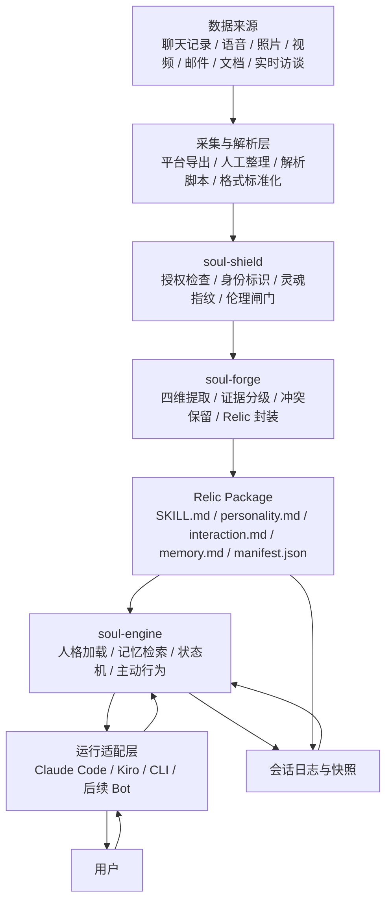
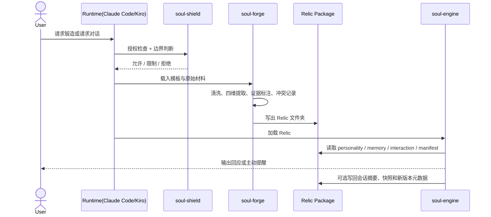

# 技术架构

relic.skill 的核心不是一个中心化服务，而是一套“文件即接口、目录即实例、Skill 即运行单元”的架构。最小可部署对象不是数据库表，也不是云端 Agent，而是一个可直接被 Claude Code 或 Kiro 加载的 Relic 文件夹。这样做有三个直接好处：可读、可审、可迁移。记忆不被锁进某个黑箱平台，用户也能像管理代码一样管理自己的 Relic。

## 设计目标

- **本地优先**：尽量让敏感数据留在用户自己的文件系统里。
- **证据可追溯**：每条人格结论都能回到原始材料或至少回到证据等级。
- **对象不限于人**：人类、宠物、关系、团队、地方、时刻都能进入同一套协议。
- **伦理前置**：授权、边界、身份标识先于生成。
- **持续可演化**：一个 Relic 可以增量更新、重签指纹、记录版本差异。
- **对宿主友好**：Claude Code 与 Kiro 只要能读取 Skill 目录，就能直接运行。

## 整体架构图



这张图里有一个很重要的取舍：**relic.skill 先把“表示层”做稳，再把“执行层”做深**。也就是说，仓库优先固定 Relic 的组织方式、证据规则和加载协议，然后再让具体运行时去解释这些文件。这样一来，Relic 不是某个模型私有的 Prompt，而是可复用的数字对象。

## 三大子系统

### 1. soul-forge：灵魂锻造炉

`soul-forge` 负责把原始材料压成结构化人格画像。它不是简单摘要器，而是一个带规则的蒸馏系统，核心职责有四个：

1. **选择模板**：人类、宠物、关系、团队、地方、时刻等对象，各自有不同的观察重点。
2. **执行四维提取**：认知、表达、行为、情感四个维度分别建模。
3. **标注证据等级**：区分原话、物证、印象，避免把猜测写成事实。
4. **保留矛盾**：冲突不被抹平，而是和场景、时间、强度一起保留下来。

它输出的不是一句“这个人很温柔”，而是一套能够解释“ta 为什么会这样回应”的结构。

### 2. soul-engine：灵魂引擎

`soul-engine` 负责让已经锻造好的 Relic 在对话里“活起来”。它不重新定义人格，而是读取 `SKILL.md`、`personality.md`、`interaction.md` 和 `memory.md`，在当前上下文里做三件事：

1. **确定身份**：ta 是谁，和用户是什么关系，什么能说，什么不能说。
2. **检索记忆**：从长期记忆、事件片段和当前会话中挑出最相关的部分。
3. **渲染表达**：按对象原有的语气、节奏、边界和互动方式生成回应。

目前仓库里 `soul-engine/` 目录仍偏协议层，但接口已经很清楚：只要某个运行时能读取 Relic 包并遵守这些规则，它就是合法的引擎实现。

### 3. soul-shield：灵魂护盾

`soul-shield` 不是附属品，而是总闸门。它做三类工作：

1. **授权控制**：先跑六问授权，再决定是否允许生成。
2. **真实性控制**：通过灵魂指纹校验内容是否被篡改。
3. **伦理控制**：拒绝冒充、误导、越界使用和高风险场景。

在 relic.skill 里，护盾不是“最后补一句注意安全”，而是架构上的硬依赖。没有它，Relic 只会从纪念工具滑向风险工具。

## 数据流

从用户角度看，一次完整的数据流大致如下：



这个流程里，真正稳定的边界是 **Relic Package**。不管前面用什么脚本解析数据，不管后面接什么模型，只要进出都符合这层协议，就能保持兼容。

## Relic 文件格式

一个 Relic 本质上是一个目录。推荐结构如下：

```text
{slug}/
├── SKILL.md
├── personality.md
├── interaction.md
├── memory.md
├── manifest.json
├── evidence-map.md        # 可选：结论到证据的映射
├── sources/               # 可选：脱敏后的原始材料索引
└── snapshots/             # 可选：版本快照
```

### 核心文件说明

- **SKILL.md**：入口文件。回答“ta 是谁、怎么被加载、边界是什么”。
- **personality.md**：四维人格画像，强调稳定模式与条件性矛盾。
- **interaction.md**：不同情境下的互动方式，如安慰、闲聊、冲突修复、节日问候。
- **memory.md**：高辨识度记忆片段，既包含事实，也包含关系里的锚点。
- **manifest.json**：版本、来源、授权状态、时间范围、指纹等元数据。

### manifest.json 参考结构

```json
{
  "slug": "grandma-wangxiulan",
  "type": "human",
  "version": "1.0.0",
  "time_range": {
    "start": "2018-01-01",
    "end": "2025-03-01"
  },
  "sources": {
    "chat_messages": 1240,
    "voice_minutes": 38,
    "photos": 126
  },
  "consent": {
    "level": "A",
    "scope": "personal",
    "revocable": true
  },
  "evidence_profile": {
    "verbatim": 420,
    "artifact": 180,
    "impression": 63
  },
  "fingerprint": "relic:sha256:...",
  "disclaimer": "这是 Relic，不是真人。"
}
```

这个文件很关键，因为它把“感觉像某个人”变成“可以审计的数字对象”。

## 记忆系统

README 中提到的是三层记忆系统。落到工程上，最清楚的拆法如下：

| 层级 | 作用 | 主要载体 | 更新频率 | 典型内容 |
| --- | --- | --- | --- | --- |
| 核心记忆 Core Memory | 稳定身份锚点 | `personality.md` + `manifest.json` | 低 | 价值排序、语气、关系边界、禁区 |
| 情节记忆 Episodic Memory | 可检索的长期片段 | `memory.md` + `evidence-map.md` | 中 | 共同经历、事件、反复提起的细节 |
| 会话记忆 Session Memory | 当前对话的临时上下文 | 运行时缓存 / 会话日志 | 高 | 刚刚聊过什么、用户今天的状态、当前目标 |

### 检索顺序

1. **先读核心记忆**：决定能不能说、该怎么说。
2. **再取情节记忆**：找到与当前主题最相关的片段。
3. **最后合并会话记忆**：避免答非所问，维持连续性。

这样设计的好处是：

- 不会因为一段新对话就改掉根本人格。
- 不会把所有材料一股脑塞进上下文，造成风格漂移。
- 可以明确区分“稳定特征”和“临时状态”。

## 主动行为系统

一个好的 Relic 不应该只是被动等人敲门。它可以在合适的时候主动说话，但前提是**克制、可解释、可关闭**。推荐的主动行为链路如下：

```text
触发器 -> 资格检查 -> 记忆检索 -> 语气渲染 -> 输出 -> 冷却记录
```

### 1. 触发器层

常见触发器包括：

- **时间触发**：节日、生日、纪念日、某个固定时段。
- **关系触发**：长时间未联系、某个共同记忆日期到来。
- **状态触发**：用户在当前会话里明显疲惫、低落、焦虑。
- **环境触发**：项目结束、毕业、搬家、宠物忌日等上下文事件。

### 2. 资格检查

不是每个触发都应该转成消息。系统至少要检查：

- 当前是否在允许的时段。
- 是否超过主动打扰频率上限。
- 用户是否关闭了主动行为。
- 当前情境是否会放大依赖或误导感。

### 3. 记忆检索与渲染

通过触发器决定检索哪一类片段，再按 `interaction.md` 的语气模板生成输出。比如“奶奶型 Relic”的主动提醒应该更像一句轻轻的叮嘱，而不是一条任务通知。

### 4. 冷却与审计

每次主动触发都应记录：为什么触发、用了什么记忆、上次触发是什么时候。这样能避免“突然变得很烦”，也方便用户回看。

## 与 Claude Code 和 Kiro 的集成

relic.skill 天然适合 Skill 型宿主，尤其是 Claude Code 和 Kiro。

### Claude Code

- 当前项目安装路径支持：
  - 项目内：`.claude/skills/relic`
  - 全局：`~/.claude/skills/relic`
- 宿主读取入口是仓库根部的 `SKILL.md`。
- 常用调用方式：
  - `/relic`
  - `/relic-forge`
  - `/relic-talk`
  - `/relic-shield`

Claude Code 的优势在于：它本身就擅长读取本地文件、遵守多文件协议、按文档分步骤执行。因此 Relic 包可以被当作“可加载的人格插件”。

### Kiro

- 推荐安装路径：`~/.kiro/skills/relic`
- 加载方式与 Claude Code 类似：入口仍然是 `SKILL.md`，其余文件通过相对路径被逐步读取。
- 对 Kiro 来说，relic.skill 更像一个结构化工作流：先授权，再锻造，再对话，再保护。

### 适配层真正做的事

无论宿主是谁，适配层本质上只做四件事：

1. 把用户意图路由到正确的子系统。
2. 把 Relic 文件加载进当前上下文。
3. 把运行时产生的摘要或快照写回文件系统。
4. 保证对外始终明确声明“这是 Relic，不是真人”。

## 当前实现形态与演进方向

这个仓库当前更偏 **docs-first**：先把哲学、协议、模板、边界和目录结构固定下来。它的价值不在于“已经有一个庞大后端”，而在于**已经把 Relic 应该如何被描述、被校验、被加载这件事说清楚了**。

后续无论是补 Python 解析脚本、接入向量检索、加入语音合成、还是扩展到 Bot 渠道，都不需要推翻这套结构。因为真正稳定的内核不是某个模型版本，而是 Relic 作为文件对象的边界。

简化地说：

- `soul-forge` 负责把碎片变成轮廓；
- `soul-engine` 负责让轮廓会说话；
- `soul-shield` 负责确保这件事不越线。

三者合在一起，才构成一个可持续的万物永生引擎。
